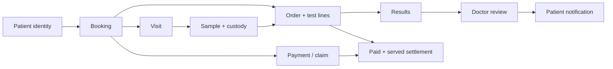

# Kura clinic operations — logic và flow hợp nhất

Tài liệu này là product/domain truth cho prototype `FINAL DCM`. Phạm vi cố ý bỏ qua UI và chỉ mô tả quyết định, quyền, trạng thái, invariant và edge case của doctor, receptionist và phlebotomist.

## 1. Nguồn và thứ tự ưu tiên

1. Source hiện tại của [`Kura-med/kura-platform`](https://github.com/Kura-med/kura-platform), commit review `89261c87e4e4a56a9b5dc7bdce734b92a6cc175b` ngày 14/07/2026.
2. ADR và contract trong source platform, đặc biệt patient identity/phone gate, booking aggregate, sample lifecycle, pricing/commission, money và RBAC.
3. Notion Kura:
   - [Clinic Patient Intake v1](https://app.notion.com/p/37dbdd6cb9f181c78245e1b80fe5d633)
   - [Booking Origination Matrix](https://app.notion.com/p/37dbdd6cb9f1814e9b77dbfe2749afd9)
   - [Lab Send-In](https://app.notion.com/p/37dbdd6cb9f181a089ccfdee6a47700f)
   - [Clinic DCM](https://app.notion.com/p/37dbdd6cb9f181dbb27ae7d465bd51cc)
   - [Booking detail](https://app.notion.com/p/388bdd6cb9f18160892ce27930ecd5b9)
   - [New booking](https://app.notion.com/p/388bdd6cb9f181d08498f331e85c1394)
   - [Start intake](https://app.notion.com/p/388bdd6cb9f18131bb7ac8b8b862b68b)
   - [Visit note](https://app.notion.com/p/388bdd6cb9f181e186ecf0ff365b5a80)
   - [Finish visit](https://app.notion.com/p/388bdd6cb9f181d09360f9ef234dfe79)
   - [Paylink](https://app.notion.com/p/388bdd6cb9f1817a9405dc8d5193c81a)
4. Logic đang tồn tại trong `FINAL DCM`, nếu không mâu thuẫn các nguồn trên.

Notion có một số snapshot cũ hơn source July 14. Khi status “Not started” hoặc scope cũ mâu thuẫn với service đã tồn tại trong source hiện tại, source hiện tại được ưu tiên cho mechanics. Nội dung trong ChatGPT Project Kura chưa được dùng làm nguồn vì môi trường không mở được privileged browser bridge và request không chứa URL trực tiếp của project; không được giả định rằng phần đó đã được review.

## 2. Mô hình domain: không gộp các trục trạng thái

Một episode clinic có nhiều aggregate liên quan nhưng không phải một “status” duy nhất.

| Aggregate | Câu hỏi nó trả lời | Không được suy ra từ |
|---|---|---|
| Patient identity | Đây là ai, assurance đến đâu? | Phone match hoặc role label |
| Booking | Quyền đến khám/lấy mẫu có tồn tại không? | Order đã hoàn thành |
| Visit | Người bệnh đã đến, đã positive-ID, đã draw chưa? | Payment |
| Order | Những test nào được yêu cầu và fulfillment đến đâu? | Booking status |
| Sample | Specimen đang ở đâu, có hợp lệ không? | Visit hoặc payment |
| Payment/claim | Tiền đã được thu/claim chưa? | Sample/result |
| Settlement | Split nào đã freeze và được payout chưa? | Chỉ “paid” |
| Result review | Doctor đã review, notify và close loop chưa? | Lab đã trả result |



Quy tắc quan trọng: sample progression không tự thu tiền, result về không tự settle claim, payment thành công không tự xác nhận service, và role name không tự cấp quyền.

## 3. Identity truth

### 3.1 Assurance độc lập với patient/booking status

```text
provisional → phone-verified → nid-verified
```

- Phone là contact key, không phải person identity.
- `phone-verified` chứng minh người đang tham gia flow kiểm soát số điện thoại; không chứng minh người đó chính là patient.
- NID dùng để dedupe và nâng assurance sau positive identification.
- Merge patient không chạy giữa episode đang có order/sample sống; collision vào merge queue và xử lý sau episode/result.

### 3.2 Doctor-mediated phone flow

Doctor đang gặp người bệnh trực tiếp, vì vậy phone flow luôn dùng OTP:

1. Chuẩn hóa phone về E.164.
2. Gửi OTP; prototype chỉ chấp nhận code `123456`, không phải bất kỳ chuỗi 6 số.
3. Tra Kura-wide bằng phone và chỉ hiện candidate redacted trước khi doctor xác nhận.
4. Nếu một số thuộc guarantor/guardian, hỏi “ai là patient?” và chọn holder/dependent; holder không tự động là patient.
5. Nhánh:
   - Exact known patient → reuse.
   - Shared phone, không candidate nào đúng → provisional khác người.
   - No match → chạy dedup preflight bằng name + DOB/YOB/age + sex rồi mới provisional.
   - New dependent dưới guarantor → provisional dependent.
6. Booking luôn có `patient_id`; provisional patient được tạo trước booking.

Không được bypass OTP chỉ vì patient nằm trong “recent”, trừ khi identity đã được resolve ở một upstream flow có decision + assurance đầy đủ.

### 3.3 Receptionist: ba cửa intake

Reception là trusted desk, khác doctor phone gate.

#### Cửa 1 — booking code

1. Resolve booking code.
2. Trả booking + patient của booking.
3. Ghi audit actor, workspace, identifier type và outcome.
4. Không dùng code để thay thế positive-ID tại ghế lấy máu.

#### Cửa 2 — exact phone

1. Exact normalized phone lookup, actor + workspace bắt buộc.
2. Một match duy nhất: desk có thể resolve không OTP.
3. Trusted lookup không chứng minh phone control và không tự nâng assurance; giữ assurance hiện có của patient.
4. Zero match: không trả PII, chuyển cửa 3 nếu là walk-in.
5. Nhiều match: không tự chọn; disambiguate bằng name + DOB/age + sex.
6. Audit lưu phone HMAC/match count, không lưu raw phone trong event.

#### Cửa 3 — walk-in

1. Thu name + DOB hoặc YOB/age + sex + contact phone nếu có.
2. Chạy duplicate preflight.
3. Tạo provisional patient tại desk, không cần OTP.
4. Check-in visit và attach/create booking.
5. Positive-ID/NID tại phlebotomy mới nâng assurance; không tuyên bố patient đã verified ở bước create.

### 3.4 Stable provisional identity trong prototype

Mọi entry point dùng cùng canonical input `name + phone + DOB/age + sex`, NFC-normalized, để sinh stable prototype ID/MRN. Nó thay cho các mã cục bộ như `PROV-0001` vốn bị trùng giữa desktop, mobile, catalog và intake. Production vẫn phải dùng server-generated UUID và idempotency key.

## 4. Visit và phlebotomy

### 4.1 Visit state machine

```text
planned → arrived → identity-resolved → draw-complete → completed
    └──────────────→ cancelled
```

- Reception owns `arrived` và desk identity resolution.
- Phlebotomist owns positive-ID và `draw-complete`.
- Payment không thay đổi visit status.
- Sau draw không “cancel specimen”; dùng reject/discard/recollection theo sample domain.

### 4.2 Positive-ID tại ghế lấy máu

Trước khi register draw:

1. Patient tự nói name.
2. Patient tự nói DOB; staff không được hỏi dạng dẫn dắt “Anh/chị có phải X, sinh ngày Y không?”.
3. Staff capture NID nếu có.
4. Đối chiếu booking/patient.
5. Nếu NID unique → assurance thành `nid-verified`.
6. Nếu NID trùng patient khác → vẫn có thể draw sau positive-ID, tạo merge queue item, không merge/cancel live episode.
7. Nếu không verbalize được, phải đi exception/supervisor flow; không được giả lập check pass.

## 5. Sample, custody, rejection và recollection

### 5.1 Sample được sinh khi draw

PSC patient-in không tạo sample giả ở booking time. `RegisterDrawSample` sinh sample thẳng tại `collected`. `awaiting-collection` chỉ dùng khi product chủ động pre-create sample cho scheduled/HBC flow.

```text
awaiting-collection → collected → received-at-lab → accepted → consumed
                         ├────────→ rejected → discarded
                         └────────────────────→ discarded
```

- Mỗi bước custody có actor, workspace, time, from/to location và sample id.
- Sample có processing workspace và originating workspace riêng.
- Sample ↔ test là many-to-many; một tube có thể phục vụ nhiều test.
- `accepted` không đồng nghĩa result đã có.
- Result terminal mới làm order line “served” cho settlement.

### 5.2 Rejection

Rejection luôn có:

- reason code ổn định;
- human label;
- fault attribution: collector, courier, lab hoặc patient;
- timestamp;
- custody event/outbox event.

Không sửa sample rejected thành collected. Rejected sample là lịch sử bất biến.

### 5.3 Recollection

1. Reject old sample với structured reason.
2. Tạo booking recollection mới liên kết old sample.
3. Replacement sample chưa tồn tại cho tới draw mới.
4. Khi draw mới, sample mới có `supersedesSampleId` trỏ old sample.
5. Không merge/cancel live order chỉ để sửa identity collision.

### 5.4 Lab Send-In / blood-in

Đây là product khác, hiện deferred:

- Patient không tới clinic.
- Identity có thể vĩnh viễn chỉ phone-only/unconfirmed.
- Chokepoint là specimen accession bench, không phải reception.
- Input tối thiểu: name + DOB/YOB + sex + phone.
- Vì specimen có thể không lấy lại được, matching band rộng hơn và resolution cần explicit exception handling.

Không trộn blood-in vào patient-in PSC flow hiện tại.

## 6. Booking và order

Platform booking aggregate có các type như PSC visit, self-registration, photo order, HBC visit, tube pickup, telehealth và follow-up; state platform là draft/issued/scheduled/redeemed/expired/cancelled. Prototype doctor projection vẫn dùng `scheduled/in-progress/results-back`, nhưng clinic truth nằm ở `visitStatus` và `sampleStatus` độc lập.

Order có state placed/in-fulfillment/partially-complete/completed/cancelled. Fulfillment được recompute từ sample và test terminal states; không dựa vào payment.

Invariant:

- Create booking/order cần idempotency key.
- Booking có thể tồn tại trước order; `order_id` có thể null ở platform.
- Doctor patient-in v1 tạo provisional trước booking để `patient_id` không null.
- Edit/cancel khóa khi sample đã được draw. Sau đó dùng rejection/recollection, không rewrite episode.
- Cancel trước draw vẫn được phép dù payment đã thu; payment chuyển refund thay vì dùng “đã paid” để khóa cancel.

## 7. Payment, refund và claim

Payment là command explicit:

- `waiting/pending/deferred → collected` cho KHQR/cash/PSC collection.
- `pending-claim → claimed` cho insurer settlement.
- Cancel khi `collected/claimed` → `refunded`.
- Cancel khi chưa settled → `voided`.

Không có transition sample/result nào được gọi payment command ngầm. Reception/payment service xác nhận thu tiền; claim workflow xác nhận claim.

Paylink hiện vẫn là later/not-started product trong Notion: verified doctor, phone-verified patient, tests, USD/KHR, một ABA PayWay hosted link, SMS, expiry 180 giây và idempotency chống double charge. Không coi prototype timer là gateway production.

## 8. Pricing, commission và settlement

### 8.1 Money invariant

- Storage dùng universal exponent-2 cho mọi currency: major × 100.
- USD canonical pricing.
- KHR là tender ở charge boundary; ledger/settlement canonical USD.
- Chỉ money library được làm arithmetic/rounding production.

### 8.2 Commission resolver

Commission không phải 15% global. Nó resolve theo từng test line, lưu basis points + source + pricing version:

1. `splitRevenue=false` → `0 / internal.kept` và stop.
2. branch per-test.
3. branch blanket.
4. workspace per-test.
5. workspace blanket.
6. global per-test.
7. global blanket.

Lưu ý branch blanket ưu tiên hơn workspace per-test. Mỗi line freeze resolution đã dùng; booking có thể có nhiều rate/source. Split minor-unit dùng floor cho tenant share và platform nhận residual để invariant luôn đúng:

```text
tenantEarnsMinor + platformKeepsMinor = linePriceMinor
```

STAT/courier fee không phải test line nên không nhận commission test.

### 8.3 Khi nào earning được freeze

```text
settlementEligible = paid AND served
```

- Paid nhưng chưa served → pending.
- Served nhưng chưa paid → pending.
- Direct Kura payment + paid + served → earning confirmed.
- Doctor/clinic thu cash + paid + served → clinic giữ doctor share/fee và owe platform residual.
- Payment alone không được đưa earning vào available balance.

## 9. Results và close-the-loop

```text
unreviewed → reviewed → notified → closed
```

- Lab results-back chỉ mở work queue; không tự review.
- Doctor review có interpretation/plan action.
- Release/notify gate kiểm tra identity assurance và accepted/consumed sample.
- Provisional/phone-only result có thể được doctor review nhưng không auto release nếu assurance policy yêu cầu NID.
- `closed` chỉ sau `notified`. Nếu sau này cần “close without message”, phải có structured reason/audit command riêng; không cho nút nhảy reviewed → closed.
- Abnormal/critical plan-review path cũng phải notify trước close, giống normal path.

## 10. Authorization và audit

Persona mô tả product ownership nhưng không phải quyền:

- Doctor: redacted lookup, provisional create, booking create, result review.
- Receptionist: exact-phone trusted lookup, provisional create, code resolution, check-in, payment capture.
- Phlebotomist: positive-ID, NID capture, draw registration, custody, reject/recollect.

Mọi operation phải check effective workspace capabilities từ authz. Không authorize bằng `role === "Front Desk"`, không tin permission nhúng trong JWT, và không dùng persona defaults để grant access. RBAC platform hiện mới có permission catalog workspace/member/branch/role; clinic operational permissions là gap upstream cần bổ sung trước production enforcement.

Audit tối thiểu:

- actor id, workspace id, branch nếu có;
- command, target aggregate id, outcome;
- idempotency key cho create/capture;
- phone HMAC thay raw phone;
- match count và identity decision;
- custody events bất biến;
- commission source/version;
- refund/void reason;
- result release/notification event.

## 11. Các lỗi logic đã sửa trong `FINAL DCM`

| Lỗi | Hậu quả | Sửa |
|---|---|---|
| Mobile/desktop có nơi chấp nhận bất kỳ 6 số OTP | Phone verification giả | Một verifier chung, chỉ code demo hợp lệ |
| Nhiều flow tự tạo `PROV-0001` hoặc counter component-local | Trùng patient/MRN và split identity graph | Stable provisional key chung qua mọi entry point |
| `advanceBooking` đồng thời collect sample, collect payment và settle claim | Mất audit ownership, paid/served bị nhập nhằng | Tách visit/sample progression; payment chỉ qua command explicit |
| Sample bị coi đã tồn tại/chuyển status từ booking proxy | Không đúng sample-ms | Sample sinh tại registered draw, có custody trail |
| Commission hardcode 15% trên booking total và cả STAT fee | Sai pricing matrix, sai split | Per-line basis points/source/version; STAT không commissionable |
| Payment-only làm earning available | Trả tiền trước khi service | Freeze chỉ khi paid + served |
| Cash tạo “doctor owes Kura” ngay cả chưa served | Liability chưa đủ điều kiện | Chỉ post owed balance khi paid + served |
| Paid booking không cancel được dù code có refund branch | Refund branch unreachable | Cho cancel trước draw; collected/claimed → refunded |
| reviewed có thể nhảy thẳng closed | Patient chưa được notify nhưng loop báo closed | Chỉ notified → closed; bỏ shortcut không reason |
| Abnormal mobile flow toast “notified” nhưng không gọi notify | Audit và UI nói khác state | Gọi notify trước close |
| Mobile gửi patient-facing booking code nhưng store chỉ match internal order code | Review/notify/close no-op trong khi toast báo thành công | Command matcher nhận internal, booking hoặc handover code |
| Internal order sequence reset về 0 sau reload | Tạo lại `ORD-0001`, command có thể update nhiều booking | Resume sequence từ toàn bộ persisted/seed orders |
| Paylink dùng VND và đảo chiều commission | Lệch Kura USD/KHR + tenant/platform split | Dùng USD/KHR và versioned resolution |
| Role/persona dễ bị dùng như permission | Bypass tenant authz | Capability check model tách khỏi persona defaults |

## 12. Những phần chưa được tuyên bố là hoàn tất

- Không review được nội dung private trong ChatGPT Project Kura vì browser bridge không khả dụng và không có project URL trực tiếp.
- Không sửa repo `Kura-med/kura-platform`; review này dùng nó làm upstream truth. Trong upstream, operational RBAC permissions cho patient/booking/sample vẫn cần được thiết kế/coded.
- Receptionist MFE upstream hiện có shortcut UI “sample collected” chưa chứng minh đã gọi sample-ms `RegisterDrawSample`; đó là integration gap.
- Lab Send-In/blood-in vẫn deferred, không được âm thầm bật bằng patient-in logic.
- Paylink production vẫn chưa shipped theo Notion.
- UI cho receptionist/phlebotomist không nằm trong scope; domain commands/state machine đã được thêm để UI/API sau này gọi đúng.
