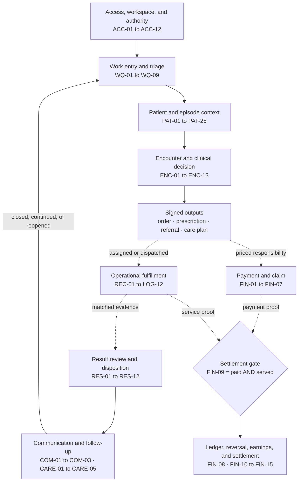
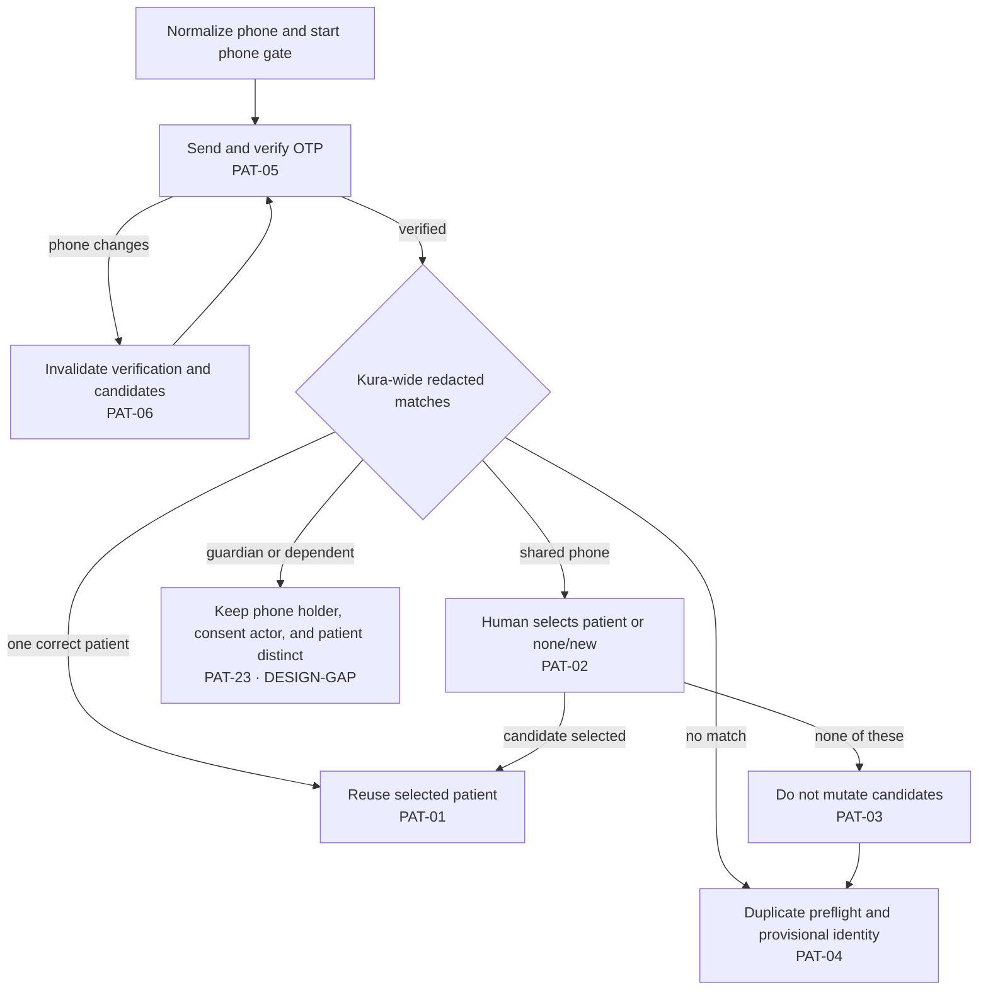
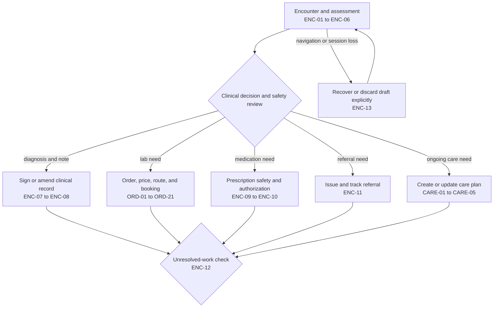
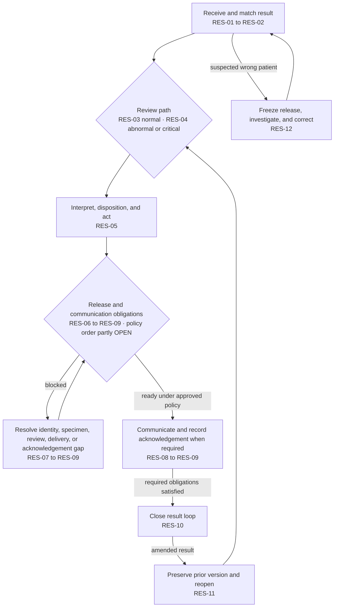
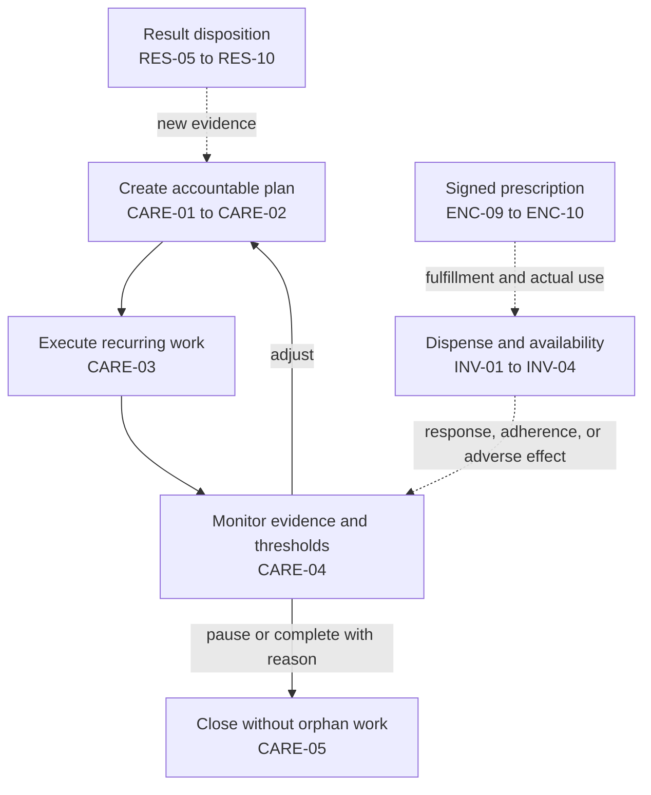

# Doctor care-loop map

This map shows how a doctor moves from work entry to documented closure while patient, operational, laboratory, financial, and administrative work changes around the same care episode.

It is a projection of the current [domain truth](../00-source-of-truth/clinic-operations-domain-truth.md), [end-to-end journeys](end-to-end-journeys.md), [journey catalog](journey-catalog.md), and [case matrix](journey-case-matrix.md). The [source register](../05-traceability/source-register.md) governs conflicts: current Kura platform backend evidence wins, while legacy repositories may reveal cases or gaps but cannot define current behavior. The map does not convert an `OPEN`, `DEFERRED`, or `PARTIAL` journey into settled behavior.

## Outcome and closure

When new work, a patient encounter, or new clinical evidence requires attention, the authorized doctor must understand the correct patient and episode, make and sign the necessary decision, coordinate fulfillment, review the resulting evidence, act and communicate, and retain ownership until the care obligation is closed or explicitly transferred.

Closure requires all applicable evidence below:

- the clinical decision and signer are recorded;
- each order, prescription, referral, task, or communication has a truthful lifecycle state;
- the next owner accepted the handoff or the doctor still sees the unresolved obligation;
- the result or response was reviewed and dispositioned;
- required patient or care-team communication was completed or has an explicit unresolved state;
- follow-up was completed, continued, cancelled, amended, or reopened with audit evidence.

## Trigger-to-closure map

Solid arrows are required lifecycle transitions. Dashed arrows are asynchronous handoffs or independent dependencies. A branch is optional unless its guard is met.

The map intentionally does not place patient alternatives, clinical outputs, payment, specimen progression, or result communication into one forced sequence.

## Independent lifecycle axes

Never infer one row from another.

| Axis | Current source-backed lifecycle | Doctor-visible obligation |
| --- | --- | --- |
| Identity assurance | `provisional → phone-verified → nid-verified` | Know whether the action is allowed, blocked, or requires manual review. |
| Visit | `planned → arrived → identity-resolved → draw-complete → completed`, with cancellation where allowed | See whether the patient arrived and whether operational work remains. |
| Sample and custody | `awaiting-collection? → collected → received-at-lab → accepted → consumed`, with reject, discard, and recollection branches | See truthful fulfillment, defect, delay, and recollection state. |
| Payment and claim | `pending/waiting/deferred/pending-claim → collected/claimed → refunded/voided` | See affordability and obligation without treating payment as service proof. |
| Result review | `unreviewed → reviewed → notified → closed`, with release gates and amendment/reopen | Retain review, action, communication, and follow-up ownership. |
| Settlement | pending until payment and service proofs both exist; corrections append reversals | See explainable pending, earned, debt, reversal, and statement state. |

## Patient identity branches

The doctor-mediated phone flow is a decision tree, not `PAT-01 → PAT-06` in sequence.

Reception lookup and phlebotomy positive identification remain separate journeys. A booking code or exact-phone desk lookup does not replace active name-and-DOB identification at the draw.

## Clinical decision outputs

The doctor may create several outputs from one decision. Referral, prescription, order, and care plan are not mandatory steps in a fixed sequence.

Finishing the visit closes the encounter only. Orders, results, tasks, communication, and monitoring remain queued until their own closure conditions are met.

## Result closure

The exact ordering of release, notification, acknowledgement, and critical escalation remains governed by unresolved policy where the catalog says `OPEN`.

## Care plan and medication monitoring

## Required handoffs

| Transfer | Sender → next owner | Acceptance evidence | Failure and recovery that must remain visible |
| --- | --- | --- | --- |
| Booking and preparation | Doctor/system → reception, scheduler, or collection team | One persisted booking/order and usable code or task | Idempotent return on retry; failed delivery is a retryable message event, not a new booking. |
| Arrival to draw | Reception → phlebotomist | One queue item with resolved patient, booking, workspace, and current visit state | Duplicate enqueue is idempotent; stale or wrong context blocks mutation and returns to resolution. |
| Collection to transport | Collector → courier | Signed custody event for the exact sample/package set | Receiver can refuse mismatch; failed or late pickup remains an exception with an owner. |
| Transport to lab | Courier → lab receiver | `received-at-lab`, followed by a separate accession decision | Rejection keeps the original sample history and creates a linked recollection path when required. |
| Result to doctor | Lab/system → authorized reviewer | One matched, versioned result and one actionable work item | Unmatched or duplicate events are quarantined or reconciled; no false review state. |
| Doctor to patient or care team | Doctor/system → verified recipient | Delivery, failure, retry, and acknowledgement or read-back when required | Failure stays unresolved; alternate channels and escalation require approved policy. |
| Care plan to task owner | Doctor → staff, patient, or doctor | Task has owner, cadence, dependency, and completion evidence | Missing owner blocks activation; overdue, skipped, blocked, and reassigned work stays visible. |

Exact timing and escalation rules are not supplied where the source register marks policy `OPEN`.

## Readiness and status rules

- Coverage is shown in the [doctor journey coverage matrix](doctor-journey-coverage-matrix.md), never inferred from lane color.
- `IMPLEMENTED` means evidence exists in code or an executable flow; it is not production certification.
- `PARTIAL` means at least one required branch, guard, state, or integration is missing.
- `DECIDED` means the logic is resolved but delivery is not proven.
- `OPEN` remains a decision gate.
- `DEFERRED` must not appear live.
- `DESIGN-GAP` means the current design omits or contradicts required logic.

## Detailed flows still required

These source gaps block a fully testable doctor care-loop specification:

1. **Critical result escalation and communication:** result classes, reviewer and backup owner, release order, acknowledgement versus read-back, timeout, escalation chain, unreachable patient, closure, and amendment behavior for `RES-04` and `RES-06` to `RES-12`.
2. **Guardian, minor, dependent, and proxy identification:** relationship, consent authority, patient unable to self-identify, draw exception, release permission, and correction for `PAT-23` to `PAT-25`.
3. **Medication safety and fulfillment:** terminology and interaction source, warning severity, override authority, prescription cancellation/amendment, pharmacy or dispensary handoff, unavailable medication, actual use, and monitoring for `ENC-09`, `ENC-10`, and `INV-01` to `INV-04`.
4. **Care-plan ownership and versioning:** accountable owner, cadence, recurring task generation, threshold escalation, pause, completion with outstanding work, reactivation, and version behavior for `CARE-01` to `CARE-05`.
5. **Authority and interrupted work:** jurisdictional authority, operational capability catalog, workspace revocation, session expiry, draft recovery, and delegated action for `ACC-05` to `ACC-12` and `ENC-13`.

Until an approved source resolves them, these remain `OPEN`, `PARTIAL`, or `DESIGN-GAP` and must not be presented as product truth.
