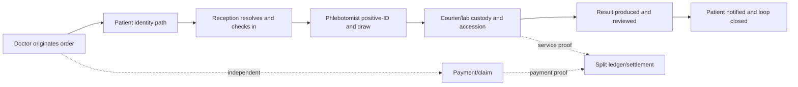

# Kura Clinic end-to-end journeys

These journeys describe the product as one operating system across roles. They deliberately do not follow screen boundaries.

## Shared lifecycle model

The apparent order above does not couple the state axes. Payment may occur before or after collection. A visit can complete while payment is deferred. A result can arrive while notification remains open. Each step writes only the event/state it owns.

## E2E-01 — Known patient, doctor-originated PSC collection

**Actors:** patient, doctor, receptionist, phlebotomist, lab, doctor reviewer.  
**Trigger:** patient is physically with a doctor; phone maps to at least one Kura patient.  
**Preconditions:** verified doctor/capability; clinic-scoped OTP; non-empty test basket.

1. Doctor enters and normalizes the patient phone; the patient reads the OTP face-to-face.
2. Kura returns all matches as redacted cards. The doctor confirms one person; no demographics are overwritten.
3. Doctor confirms tests, per-line pricing/payer, and PSC route. Kura creates one idempotent booking and a code.
4. Reception resolves by code, preserving the existing assurance, records `planned → arrived → identity-resolved`, and handles payment independently.
5. Phlebotomist asks the patient to state name and DOB. NID is captured if permitted; assurance may become `nid-verified`.
6. Registering the draw creates the sample at `collected`, records collector/workspaces/tests, and appends `draw-registered` custody.
7. Handoff, lab receipt, acceptance, and consumption each append custody events and move only the sample axis.
8. Result arrives as `unreviewed`. Doctor reviews, annotates if needed, releases only if gates pass, notifies the patient, and closes the loop.

**Reject branches:** OTP mismatch/expiry; wrong candidate; booking not found; positive-ID failure; wrong tube; lab rejection; release gate failure.  
**Recovery:** resend OTP within policy; choose another candidate or “none/new”; correct booking context; repeat open questions; reissue tube label; recollection; complete missing identity/review/notification step.  
**Observable outcome:** one patient, one booking, attributable sample lineage, explicit economic state, and a reviewed/notified result.  
**Coverage:** PARTIAL.

## E2E-02 — New patient, doctor-originated provisional identity

**Actors:** patient, doctor, receptionist, phlebotomist, data steward when needed.  
**Trigger:** face-to-face phone gate returns no patient or the doctor selects “none of these.”

1. Doctor verifies phone control by OTP.
2. Doctor captures minimal identity: name, sex, DOB when known, otherwise year of birth derived from age; no sentinel DOB.
3. Kura creates one stable provisional patient and a booking referencing that patient.
4. Reception resolves by code or exact phone; a trusted lookup never upgrades assurance.
5. At the chair, active positive-ID and NID capture upgrade assurance only if the NID is unique.
6. If NID collides with a golden record, keep the active patient/sample episode, create an audited merge-queue item, and process the merge after the result episode.
7. Collection, lab, result, notification, and finance continue as in E2E-01.

**Reject branches:** incomplete minimal identity; concurrent same-phone create; NID format error; NID collision.  
**Recovery:** fix fields; serialize search+create by normalized phone; recapture; queue steward review without losing the draw.  
**Observable outcome:** provisional identity can safely become NID-verified or remain gated; no silent auto-merge.  
**Coverage:** PARTIAL with decided reception/NID logic.

## E2E-03 — Shared phone, guardian, minor, or dependent

**Actors:** patient/dependent, phone holder/guardian, doctor, receptionist, phlebotomist.

1. OTP proves current control of the shared phone, not which family member is present.
2. Doctor sees every allowed redacted candidate plus “none of these/new patient.”
3. The human selects the actual patient. Guardian/contact relationship and consent are captured separately from patient identity.
4. Reception re-disambiguates when necessary using name, DOB/age, and sex; identical masked phone values must not be used as the differentiator.
5. Phlebotomist positive-identifies the patient/dependent at draw. For patients unable to self-identify, the approved proxy/two-identifier policy must be invoked and audited.

**Reject branches:** ambiguous candidates; guardian selected as patient; dependent cannot self-identify; missing consent/authority.  
**Recovery:** select another candidate/create provisional; correct relationship; apply approved proxy policy or escalate.  
**Observable outcome:** contact owner, legal/consent actor, and patient remain separate records/roles.  
**Coverage:** DESIGN-GAP for guardian/proxy policy; shared-phone selection is PARTIAL.

## E2E-04 — Reception door 1: booking-code arrival

**Actors:** patient, receptionist.

1. Reception enters/scans the seven-character booking code.
2. An exact active booking is returned with the minimum necessary patient context.
3. Reception confirms the patient context, records arrival, and routes payment/claim and phlebotomy queue actions separately.

**Reject branches:** code malformed, not found, expired, cancelled, already completed, or belongs to another workspace.  
**Recovery:** retry exact code; use exact-phone door; create walk-in only after find-or-create checks; escalate unauthorized cross-workspace access.  
**Observable outcome:** one audited resolution tied to actor and workspace, with no assurance elevation from lookup alone.  
**Coverage:** DECIDED.

## E2E-05 — Reception door 2/3: exact-phone fallback or walk-in

**Actors:** patient, receptionist.

1. Exact phone is normalized to E.164 and queried in trusted-desk context.
2. One match may resolve without OTP, preserving current assurance. Multiple matches require explicit disambiguation. Zero matches offers the walk-in path.
3. Walk-in creation first surfaces soft candidates, then creates one provisional patient and booking under a phone-scoped serialization lock.
4. Actor, workspace, lookup criterion, outcome, and selected patient are audited.

**Reject branches:** missing audit context; prefix instead of exact lookup; multiple matches without selection; race creates duplicate; user searches by unsupported free text.  
**Recovery:** supply scoped context; exact lookup; disambiguate; resolve serialized result; use later name-search only when delivered.  
**Observable outcome:** real-world lost-code arrival is supported without turning phone into a unique identity key.  
**Coverage:** DECIDED; UI coverage not proven.

## E2E-06 — Clinic draw and tube preparation

**Actors:** doctor/clinic phlebotomist, patient, courier.

1. The confirmed order produces a tube plan only; it does not create a collected sample.
2. At collection, staff opens the correct work item and performs active positive-ID.
3. Draw registration creates the sample and prints unique, sample-bound labels.
4. Every required tube is labeled in the patient’s presence, scanned, and checked against the sample/order.
5. Partial or wrong tube sets cannot be marked ready. Photo evidence, if captured, remains separate from verification.
6. A clinic-to-courier handoff records both actors, locations, time, and package/sample set.

**Reject branches:** order has no tests; leading identification question; label collision; printer offline; wrong/extra/missing tube; abandoned draw; courier no-show.  
**Recovery:** correct order; repeat open questions; reissue label; controlled downtime procedure; correct/recollect; record no-collection; reassign pickup.  
**Observable outcome:** no “prepared” or “photo captured” shortcut can manufacture a collected/verified specimen.  
**Coverage:** PARTIAL; Figma contains safety gaps.

## E2E-07 — Home collection

**Actors:** scheduler/reception, mobile phlebotomist, patient, courier/ops.

1. A valid address, contact, time slot, tests, stability window, and assigned collector create an `awaiting-collection` specimen/work item only when pre-creation is intentional.
2. Collector confirms arrival and performs the same positive-ID standard as PSC/clinic collection.
3. Failed access, patient absence, refusal, unsafe environment, or inability to identify produces no `collected` sample.
4. Successful draw transitions to `collected`, labels/scans tubes, and starts custody from the collection location.
5. Pickup/transport breaches are evaluated against stability rules, not hidden by rescheduling copy.

**Reject branches:** invalid address, no slot, patient no-show, ID failure, unsafe setting, insufficient sample, transport delay.  
**Recovery:** edit/rebook; no-show follow-up; escalate identity; reschedule; recollect; reject based on specimen stability.  
**Observable outcome:** remote collection has the same identity and custody integrity as a PSC.  
**Coverage:** PARTIAL.

## E2E-08 — Courier handoff and lab accession

**Actors:** collector, courier, receiving staff, lab.

1. Pickup job references the exact package/sample set, pickup window, destination, and handling constraints.
2. Handoff appends custody with sender/receiver, origin/destination, and time.
3. Lab receiving records `received-at-lab` independently of acceptance.
4. Receiver checks identity/label, sample type, container, volume, integrity, temperature/time, and order match.
5. Accepted specimens move to `accepted`; analysis use moves to `consumed`.

**Reject branches:** courier cannot match package; broken seal; lost item; temperature/time excursion; unreadable label; duplicate accession; order/sample mismatch.  
**Recovery:** refuse handoff; investigate custody; apply rejection reason/fault; idempotently return existing accession; recollect when required.  
**Observable outcome:** a complete, immutable custody timeline and explicit acceptance decision.  
**Coverage:** DECIDED/PARTIAL.

## E2E-09 — Sample rejection and recollection

**Actors:** lab receiver, reception/ops, patient, phlebotomist, finance.

1. Receiver rejects from an allowed state with reason code, label, fault attribution, actor, and time.
2. Original sample remains `rejected` then may be `discarded`; its history is never rewritten as collected/accepted.
3. Recollection creates a new booking/plan referencing the rejected sample. No replacement sample exists until the new draw.
4. Patient/clinic is notified according to fault/SLA policy. Charge/refund responsibility is decided independently.
5. Replacement draw creates a new sample with `supersedesSampleId` and a fresh custody chain.

**Reject branches:** invalid transition, missing reason, attempt to reuse old sample ID/barcode, duplicate recollection request.  
**Recovery:** keep current state; require coded reason; create a new sample ID; return existing idempotent recollection plan.  
**Observable outcome:** rejected and replacement specimens are both traceable, and economic corrections do not mutate specimen history.  
**Coverage:** IMPLEMENTED domain logic; operational UI PARTIAL.

## E2E-10 — Result review, critical escalation, notification, closure

**Actors:** lab, doctor, patient, escalation staff.

1. Result ingestion binds patient, order line, sample/accession, source, units, reference interval, and version.
2. New result enters `unreviewed`; abnormal/critical classification creates the appropriate work item.
3. Doctor reviews clinical context, signs interpretation/action, and may order follow-up.
4. Release checks identity assurance, accepted/consumed sample, doctor review, and notification policy.
5. Patient notification records channel, recipient, delivery state, time, and acknowledgement/read-back when required.
6. Loop closes only after the obligations for that result class are satisfied.

**Reject branches:** unmatched result; wrong units/range; duplicate version; identity/sample gate; critical alert unacknowledged; delivery failure.  
**Recovery:** quarantine/reconcile; correct/version result; finish gate; escalate on timer; retry alternate approved channel.  
**Observable outcome:** “result produced,” “reviewed,” “released,” “notified,” and “closed” are distinguishable and auditable.  
**Coverage:** PARTIAL; critical escalation policy remains OPEN.

## E2E-11 — Cash/KHQR/pay-link, cancellation, void, and refund

**Actors:** patient, receptionist/doctor, payment provider, finance.

1. Amount due is the sum of immutable priced lines in one currency and payer context.
2. Cash/KHQR/payment link creates or confirms an explicit payment intent; retries use the same idempotency key.
3. Provider callback/reconciliation, not the client success screen, moves payment to `collected`.
4. Cancellation before collection voids the intent. Cancellation after collection/claim produces a linked refund subject to identity/authorization policy.
5. Receipt and refund receipt are immutable artifacts. Sample/visit/result state does not advance as a payment side effect.

**Reject branches:** amount/currency mismatch; expired QR/link; duplicate callback; paid link replay; partial/overpayment; refund to wrong instrument; insufficient identity.  
**Recovery:** recreate unpaid intent; reconcile provider state; idempotently return collected state; route exception queue; refund original rail; complete verification/manual review.  
**Observable outcome:** no double charge, explainable current balance, and an auditable void/refund chain.  
**Coverage:** cash/KHQR PARTIAL; hosted pay-link DEFERRED.

## E2E-12 — Mixed cash/insurance basket and settlement (N≥2)

**Actors:** patient, doctor, reception/claims, payer, finance.

1. For every line, snapshot line type, list/payer price, coverage verdict, payer, collection point, origination, commission rule source/version, and rate.
2. Example with at least four lines: two covered labs, one non-covered lab, one covered/waived consultation. Resolve each independently; cross-line consult-dependent rules are explicit inputs.
3. Patient pays only their line-level responsibility; covered lines enter `pending-claim` and later `claimed`/denied.
4. A split ledger row activates only when that line has payment proof and the chosen service-delivery proof.
5. Settlement sums all activated and reversal rows per doctor and currency; office-collected debt nets in the opposite direction.

**Reject branches:** booking-level payer shortcut; unassigned rule; changed rate after booking; N-line sum differs from total; payment without service; manual ledger edit; claim denial.  
**Recovery:** resolve per line; use explicit zero/exception queue; retain snapshot; block activation; create reversal; bill/appeal per policy.  
**Observable outcome:** `Σ patient + payer = Σ priced responsibility` and `Σ doctor + Kura = Σ eligible settled lines`, with no rounding drift.  
**Coverage:** DECIDED; claims/payout DEFERRED.

## E2E-13 — Encounter to care program and follow-up

**Actors:** doctor, patient, staff.

1. Doctor starts an encounter from a known patient/booking context, captures clinical data, diagnoses, and a reviewed note.
2. Orders, prescription, referral, and care plan are separately attributable artifacts linked to the encounter.
3. Signing locks the note; later changes are amendments, not overwrites.
4. Care program defines goals, measures, cadence, responsible party, tasks, and escalation.
5. Result-driven or adherence-driven changes create new plan versions/actions.

**Reject branches:** wrong patient context; conflicting open encounter; unsigned note; unsafe prescription; task has no owner; plan edited after completion.  
**Recovery:** context confirmation; resume/close existing; sign or explicit draft; override/reject with reason; assign owner; create new version/reactivation.  
**Observable outcome:** clinical decisions have provenance and follow-up does not disappear after the visit.  
**Coverage:** PARTIAL.

## E2E-14 — Cancel, no-show, reschedule, and abandoned work

**Actors:** patient, doctor/reception, system, finance/ops.

1. Actor requests cancellation/reschedule or the no-show timer expires.
2. Policy evaluates booking time/status, collected sample existence, payment state, courier/pickup state, and outstanding result.
3. Allowed changes append events and notify affected actors. They do not erase prior booking/payment/custody events.
4. If an episode already has a collected sample, cancellation cannot pretend it never occurred; lab disposition and results obligations continue.
5. Drafts and abandoned tube-prep work are explicitly discarded/recovered; no fake sample is created.

**Reject branches:** edit after cutoff; cancellation with sample in transit; duplicate reschedule; no-show incorrectly inferred from unpaid state.  
**Recovery:** privileged exception with reason; complete specimen disposition; idempotent response; use actual arrival evidence.  
**Observable outcome:** current schedule is clear while history and downstream obligations remain intact.  
**Coverage:** PARTIAL.

## E2E-15 — External result import

**Actors:** doctor/staff, external lab, patient.

1. Import captures source organization, report date, original file/reference, importer, mapping, units, and verification status.
2. Candidate patient/order match is confirmed; ambiguity quarantines the import.
3. Imported values remain visibly source-tagged and never silently merge with Kura-verified series.
4. Doctor may review and use the information clinically, with provenance preserved.

**Reject branches:** ambiguous patient; name collision; unknown analyte/unit; duplicate file; altered document; no source.  
**Recovery:** manual reconcile; map with explicit new concept; deduplicate by source hash; verify signature or mark unverified; reject incomplete provenance.  
**Observable outcome:** useful third-party context without falsely representing Kura custody/verification.  
**Coverage:** DEFERRED.

## E2E-16 — Blood-in/send-in specimen, patient never visits

**Actors:** external clinic/doctor, courier, Kura receiving/lab, doctor reviewer.

This is a distinct product, not a shortcut around patient-in intake.

1. The order/specimen arrives with a verified phone when available plus a second identifier and strict requisition/provenance data.
2. No reception or Kura positive-ID event exists; the episode cannot automatically become NID-verified.
3. Receiving applies strict specimen/identity matching. Thin or conflicting identity goes to hold/review, not silent patient creation.
4. A narrowly governed irretrievable-specimen exception may preserve an already-drawn sample while blocking release until policy resolves identity.
5. Later PSC appearance may reconcile the record into a golden patient through audited merge.

**Reject branches:** no usable identifier; conflicting candidate; handwritten/illegible requisition; specimen mismatch; identity never resolvable.  
**Recovery:** obtain source confirmation; hold and clerically review; reject/recollect where possible; governed exception/manual release only if legally and clinically approved.  
**Observable outcome:** the product never implies that a never-seen patient received Kura positive identification.  
**Coverage:** DEFERRED with OPEN release policy.

## E2E-17 — Multi-doctor clinic and receptionist-on-behalf

**Actors:** owner, doctor, receptionist, admin.

1. Owner maintains workspace membership, clinician links, professions/specialties, and licence evidence as separate axes.
2. Receptionist chooses an authorized doctor in the active workspace and creates a booking with `created_by` = receptionist and `doctor_id` = clinician.
3. Authorization checks the active workspace/capabilities and clinician membership; a JWT role label is insufficient.
4. Audit, clinical ownership, result worklist, and economic origination use the correct actor/doctor fields.

**Reject branches:** doctor not in workspace; expired licence; workspace switched mid-draft; receptionist lacks create capability; owner removes doctor with active episodes.  
**Recovery:** choose authorized doctor; renew/reassign according to policy; invalidate/reconfirm draft; request access; preserve historical attribution and reassign future work only.  
**Observable outcome:** operational actor, clinical owner, workspace, and economic attribution never collapse into one field.  
**Coverage:** DEFERRED.

## Completion rule for any journey

A journey is complete only when:

- entry route and prerequisites are explicit;
- every mutation has an authorized owner and audit context;
- observable success is defined;
- at least one reject branch proves invalid input/state cannot advance;
- recovery does not duplicate money, patient, booking, sample, result, or ledger objects;
- downstream obligations remain visible after cancellation, failure, or role handoff;
- desktop/mobile or retry behavior cannot produce a different domain truth.
