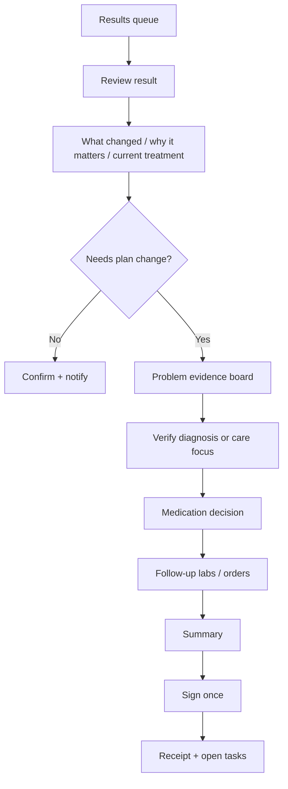

# Kura UX Audit: Canvas Medical + Pierre Post-Lab Care Plan

Date: 26 Jun 2026  
Scope: DCM doctor workspace, result review, prescribing, lab follow-up, patient-specific care plan.

## Evidence Status

- Canvas patient URL reviewed in Chrome: `https://kidney-care-trial.canvasmedical.com/patient/a000000000000018000000000000018a`.
- Direct patient page became accessible in Chrome after login. Reviewed patient chart `EG (58 M)` and profile.
- Canvas chart evidence observed: patient identity header, Chart/Profile split, left clinical summary, right note timeline, New note menu, Documents menu, patient Documents subpage, chart review note, lab note, dialysis note, prescription adjustment command, assess condition commands, referral command, coding/claim actions, commit/sign/lock states, and patient profile/coverage/payment surfaces.
- Canvas admin/model context observed: Appointments, Automations, Care team memberships, Coverages, Follow ups, Lab reports, Messages, Notes, Patients, Plans, Prescriptions, Protocol current values, Referrals, Refill requests, Tasks, and clinical documents.
- Canvas public docs reviewed:
  - `https://docs.canvasmedical.com/guides/tailoring-the-chart-to-the-patient/`
  - `https://docs.canvasmedical.com/guides/patient-chart-group-items/`
  - `https://docs.canvasmedical.com/guides/staying-on-top-of-tasks/`
- Pierre artifact reviewed in Chrome: `https://claude.ai/code/artifact/1ef245be-c5cd-440a-a41f-16c65c572e8f`.
- Current Kura implementation reviewed in local repo:
  - `src/components/ResultsWorkspace/ResultsWorkspace.tsx`
  - `src/components/DoctorMobile/screens/patients/ResultReviewScreen.tsx`
  - `src/features/care-plan/domain/resultReview.ts`
  - `src/features/care-plan/components/PlanReviewDrawer.tsx`
  - `src/features/care-plan/components/CareLoopReviewDrawer.tsx`
  - `src/components/CarePlan/CarePlanTab.tsx`
  - [`product-goal.md`](../00-source-of-truth/product-goal.md)

## Quick Diagnosis

- User / module: Kura doctor, DCM patient detail, result review, Rx, care plan.
- Task: after lab results return, review clinically meaningful changes, decide diagnosis/meds/follow-up labs, update care plan, notify/close loop.
- Observed issue in Kura: Kura has strong primitives, but the flow is still split across Results queue, Labs, result review, plan review, order draft, and care plan. The clinical decision is structurally sound but not yet compressed into one obvious post-result closure workspace.
- Likely root cause: Kura currently models the loop correctly at the domain layer, but the UI still treats result review, prescribing, ordering, and care-plan update as adjacent surfaces rather than one signed clinical event. Canvas shows a different mental model: a note is a workflow container, and clinical commands inside it progress toward commit/sign/lock/claim states.
- UX / business / safety risk: doctors may read the result, update part of the plan, and miss the medication-monitoring or follow-up-order closure; or they may trust AI suggestions without seeing enough evidence, contraindication logic, and final receipt.

## What Is Useful From Canvas

Canvas is useful less as a visual style reference and more as a workflow architecture reference. Its strongest idea is that the patient chart is not just a record viewer; it is a clinical workbench where actions are entered as commands, reviewed, committed, signed, locked, and connected to claims.

### Canvas IA Observed

- Global shell: schedule/search at top, global module icons, patient-scoped quick filters, New note, date/filter controls, documents menu, overflow actions, chat.
- Patient anchor: avatar, name, patient id with copy action, DOB/age/sex/phone, unknown status marker, sticky note, Chart/Profile tabs.
- Chart tab:
  - Left pane: clinical caption, Social Determinants, Goals, Conditions, Medications, Allergies, Care Team, Vitals, Immunizations, Surgical History, Family History.
  - Right pane: longitudinal note timeline with note cards such as Chart review, Dialysis, Lab, Home visit, Telehealth, Routine follow-up and lab results review.
- Profile tab:
  - Administrative caption, patient demographics, portal status, preferences, preferred pharmacies, consents, care team, addresses, phone numbers, emails, contacts, patient balance, coverages, outstanding claims, authorizations, payment methods, ID cards.
- Patient Documents subpage:
  - Patient-scoped document destination; currently visible as an empty list for this patient.
- New note menu:
  - Home visit, Telehealth, Office visit, Nutrition, Lab visit, Education, Inpatient, Lab, Phone call, Chart review, Letter, Message.
- Documents menu:
  - Generate Full Chart PDF, Print Basic Information, Print Chart Summary, Print Medications and Allergies, Print Specimen Labels, Print Integrated Care Plan.

### Canvas Flow Observed

The core flow is note-command based:

1. Doctor opens or creates a note.
2. Doctor adds clinical commands inside the note, such as:
   - Assess Condition.
   - Adjust Prescription.
   - Past Medical History.
   - Reason For Visit.
   - Refer.
   - Coding.
3. Each command has its own fields, saved/review state, and local action button such as `REVIEW`, `RECORD`, or `DELEGATE`.
4. The note has aggregate actions:
   - `Commit All Commands`.
   - `Sign` or `Lock`.
   - `Push charges`.
   - `Delete`.
   - Link to claim queue.
5. If commands are uncommitted, Canvas blocks signing/locking with explicit copy such as `To sign this note, please commit all uncommitted commands.`
6. Note history shows audit events: created, locked, unlocked, pushed charges, and PDF links.

This is a strong state model for Kura: high-risk clinical actions should not be a loose set of drawers and toasts. They should collect into one signed clinical event with clear preconditions.

### Canvas UX Strengths

1. Patient identity stays anchored.
   The patient header remains visible while the doctor moves between summary, note commands, and profile/admin surfaces.

2. Summary sections are both informational and actionable.
   Conditions have `Resolve` and `Assess`; medications have `Stop`, `Adjust`, `Refill`; allergies/conditions/medications can be marked reviewed.

3. The left pane keeps clinical context beside the note.
   When editing an Adjust Prescription command, the doctor can still see conditions, medications, allergies, care team, and vitals nearby.

4. Commands have intermediate states.
   Canvas separates a command being saved/reviewed from the whole note being committed/signed/locked. This reduces accidental finalization.

5. Administrative and clinical IA are separated.
   Profile holds portal, consent, coverage, balance, and contact data. Chart holds clinical work. This separation prevents result review from becoming a billing/profile page while still keeping admin blockers findable.

6. Output artifacts are first-class.
   Canvas has print/export paths for chart summary, meds/allergies, specimen labels, and integrated care plan. Kura should treat signed result review outputs as artifacts, not just UI state.

7. Claim/coding state is visible.
   Note actions include coding, push charges, claim queue links, and blocked sign/lock states. Kura's claim readiness principle should be visible in result closure.

### Canvas UX Weaknesses To Avoid

- Too many icon-only controls have weak accessible names and low discoverability.
- Left summary can become noisy because every clinical section exposes micro-actions at once.
- The note-command model is powerful but cognitively heavy; many commands, comboboxes, and empty states appear at the same visual weight.
- Medication adjustment shows interaction checks and dose fields, but the safety rationale is not framed as a clinical decision narrative.
- Lab result review appears as a note/timeline item, not as a guided problem-to-plan closure flow.
- Sign/lock/commit/claim states are robust but can feel operationally dense; Kura should translate the model into calmer, fewer steps.

### What Kura Should Apply From Canvas

1. Use a signed clinical event model.
   Kura's result review should collect diagnosis verification, medication decisions, follow-up labs, patient instructions, notification, and claim readiness into one signed closure event.

2. Put action entry points next to context.
   Conditions, meds, allergies, and target signals should expose context-specific actions, but only the next relevant action should be prominent.

3. Keep the left/right mental model.
   Canvas proves the value of persistent patient context next to the work surface. For Kura, use a compact right rail or side context that shows safety/current plan while the central flow handles the decision.

4. Make blockers explicit.
   Copy like `Commit all uncommitted commands before signing` should become Kura-specific blockers such as `Add potassium monitoring before signing Losartan` or `Notify patient before closing result loop`.

5. Preserve audit history.
   Signed care-plan/Rx/result-review events need created/signed/updated/closed history, with who/when/source.

6. Separate clinical and administrative surfaces.
   Result closure should not become a profile/payment screen, but it should surface admin blockers: no portal contact, missing consent, coverage denial, or claim not ready.

7. Treat care plan as an output artifact.
   Canvas has `Print Integrated Care Plan`; Kura should have a signed patient-specific care plan receipt/share artifact after result review.

Canvas answer: yes, there is a lot to learn from Canvas Medical. The most useful lesson is not its visual density, but its stateful clinical-command architecture: context beside work, command staging, explicit commit/sign blockers, audit trail, document outputs, and separation of chart vs profile/admin work.

## What Pierre's Artifact Adds

Pierre's artifact is the more actionable reference. It models a 63F kidney patient with 5 visits, 60 analytes, and a post-lab care plan workflow.

### Information Architecture

- Header: patient anchor, age/sex, visit span, analyte count, de-identified lab context, AI decision-support disclaimer.
- AI summary: one clinical narrative, not a table summary. It leads with "kidney patient first", CKD stage 5, anemia, stale HbA1c, albuminuria improvement.
- Severity legend: Critical, High, Watch, Controlled/normal.
- Mode switch:
  - `By panel`: labs grouped by system.
  - `By problem`: diagnosis/problem candidates with code, severity, selection, and evidence drilldown.
- Primary CTA: `Start care plan · 5 dx`.

### By Panel Mode

Labs are grouped into Renal, Electrolytes & mineral, Haematology, Glycaemic, Urate, Inflammation, Lipids, Liver, Thyroid.

Each important lab row carries:

- Label.
- Value and unit.
- Status.
- Reference range.
- Direction/trend.
- Interpretation phrase.

Examples that matter for Kura:

- eGFR 12.5, stage 5, critically low.
- Creatinine 3.86, high, worsening vs April.
- Microalbumin/Cr ratio 156, high A3, improving.
- Potassium 5.2, high-normal, "Gates ARB".
- HbA1c 6.5, borderline, "Repeat overdue".

The key UX move: lab rows are already framed as clinical decision signals, not just numeric results.

### By Problem Mode

The artifact converts lab evidence into selectable diagnosis candidates:

- N18.5 Chronic kidney disease, stage 5, Critical.
- D63.1 Anaemia of chronic kidney disease, High.
- R73.03 Prediabetes, Confirm.
- R70.0 Raised ESR, Watch.
- E79.0 Hyperuricaemia, Controlled.

Each problem has:

- Checkbox / included state.
- ICD-10 code.
- Severity.
- Change code action.
- Add comorbidity/action.
- Delete/remove action.
- Show labs drilldown.

This is the strongest pattern to apply to Kura: result review should become a problem evidence board before it becomes a care-plan edit form.

### Start Care Plan Wizard

The wizard has four steps:

1. Verify ICD-10.
2. Prescribe.
3. Order labs.
4. Summary.

This is the right mental model for high-risk post-result work: verify diagnosis first, then meds, then follow-up tests, then sign.

### Prescribe Step

Useful mechanics:

- Left rail: searchable medication recommendations.
- Right rail: "Care plan so far".
- Right rail includes verified diagnoses, allergies, current medications, new medications, tests today, tests next review.
- Added medication exposes dose, frequency, days, quantity, refills, instruction sentence.
- Medication detail explains mechanism, why, target, and monitoring.

Important safety observation:

- Losartan is allowed even with potassium 5.2, but the artifact explains the risk: it raises K+, already 5.2, start after K+ binder, monitor K+ and creatinine.
- For Kura, this should become stronger than passive rationale. If a medication is gated by a current lab, the UI should require sequencing or an explicit override reason before signing.

### Order Labs Step

Useful mechanics:

- Catalog grouped by clinical category.
- Recommended tests marked with `star`.
- Higher-risk monitor test marked with `!`.
- Selecting `Renal function + electrolytes` adds it under `Tests · today` with diagnosis provenance `N18.5`.
- Selecting `HbA1c` adds it under `Tests · today` with diagnosis provenance `R73.03`.

This is highly applicable to Kura's order draft. The order should remember why each test was selected: diagnosis, medication monitor, target, or stale result.

### Summary Step

Summary includes:

- Verified diagnoses.
- Medications with dose/frequency/quantity/refills.
- Today's draw with target/rationale.
- Next-review tests.
- Final `Create care plan & Rx` action.

Gap:

- Post-create state only changes CTA to `Care plan created`.
- It does not show a strong receipt: signed by whom, what patient receives, what order was created, what tasks remain, what was notified, or what audit trail exists.

## Current Kura Fit

Kura already has good foundations:

- ResultsWorkspace is a queue, not just a list. It groups critical, needs review, ready to notify, and closed loops.
- ResultDetail shows patient identity, booking, result age, collection route, mapped signals, result loop steps, returned tests, care plan link, and primary action.
- Mobile ResultReviewScreen already uses the right summary shape: "What changed", "Why it matters", "Current treatment".
- Normal result path can confirm and notify patient in one tap.
- Abnormal result path opens a plan update path.
- Domain helper `deriveResultReviewChangeSet` intentionally does not auto-propose medication. That is the correct clinical safety stance.
- PlanReviewDrawer stages structured changes and signs once.
- CarePlanTab has a living plan, care focuses, next clinical move, target signals, current plan, upcoming work, and plan review.

The main gap is orchestration: Kura has the ingredients, but the doctor still experiences the result closure as multiple surfaces rather than one signed post-result event.

## Priority Recommendations

### P1 — Create A Result Closure Workspace

Replace the current mental model "Review in Labs" with "Close result loop".

Proposed IA:

1. Patient anchor and result context.
2. AI summary with evidence confidence.
3. Problem evidence board.
4. Verified diagnosis/care focus step.
5. Medication decision step.
6. Follow-up labs/order step.
7. Summary and signature.
8. Receipt and next actions.

Why:

- Doctors think in problems and decisions after results return.
- Kura should reduce tab memory and bring evidence, meds, labs, and care plan into one flow.

Concrete UI change:

- In ResultsWorkspace, rename primary CTA from `Review in Labs` to `Review result`.
- ResultReviewScreen should be the landing, not a detour through Labs.
- Add a mode switch inside result review: `By signal` and `By problem`.
- Keep Labs as a supporting detail view, not the primary closure flow.

### P1 — Use A Staged Clinical Command Lifecycle

Canvas' strongest workflow pattern is not the UI chrome; it is the command lifecycle:

- Command drafted.
- Command saved/reviewed.
- Commands committed.
- Note signed or locked.
- Charges/claim pushed.
- Audit history retained.

Kura should translate this into calmer language:

1. Draft result decisions.
2. Resolve blockers.
3. Review staged changes.
4. Sign once.
5. Notify patient / create orders.
6. Close loop.
7. Show receipt and audit trail.

Concrete UI change:

- A result closure should show a small lifecycle strip: `Draft`, `Ready to sign`, `Signed`, `Patient notified`, `Closed`.
- If a blocker exists, disable signing with a specific reason, not a generic disabled button.
- Examples:
  - `Add potassium monitoring before signing this medication change.`
  - `Commit diagnosis verification before prescribing.`
  - `Patient has no portal contact. Choose SMS, print, or close without notification reason.`

### P1 — Add Medication Guardrails To Result-To-Rx Flow

Do not copy Pierre's passive medication rationale as-is.

For Kura:

- Show medication recommendation only after diagnosis/focus is verified.
- Show current allergies, current meds, renal function, potassium, pregnancy/age flags where available.
- If a drug is gated by a current lab, require one of:
  - Add required monitor/binder first.
  - Change dose.
  - Defer medication.
  - Override with reason.

Example copy:

- `Potassium is 5.2 mmol/L. Losartan can raise potassium. Add potassium follow-up or document why you are starting now.`
- Primary action: `Add monitor and continue`.
- Secondary: `Defer medication`.
- Dangerous override: `Start anyway with reason`.

### P1 — Make Diagnosis Verification The Gate Before Care Plan Writes

Kura's current domain model can infer focus by trendKey. That is useful, but the doctor should explicitly verify the problem before Kura writes diagnoses or long-term care plan changes.

Apply Pierre pattern:

- Problem row with ICD code, label, severity, evidence count, matched care focus.
- Actions: change code, remove, merge into existing focus, create new focus.
- Evidence drilldown: show values, references, trends, and source date.

Kura-specific twist:

- Avoid a generic "5 dx" bulk approval if severity is high.
- Use `Verify 3 problems` only when all are visible and selected.
- For critical result, keep one primary problem in focus first.

### P2 — Add A Persistent "Care Plan So Far" Rail

Pierre's right rail is useful because it keeps the evolving signed object visible.

For Kura, use the rail to show:

- Verified problems.
- Existing allergies and medication risks.
- Current meds.
- New meds staged.
- Labs today.
- Labs next review.
- Patient instructions.
- Notification state.

The rail should not become a second page. It should be compact and only show items affected by this result closure.

### P2 — Preserve Provenance For Every Test And Plan Change

Kura should store and display why an item exists:

- Diagnosis/focus.
- Evidence/result.
- Medication monitor.
- Target.
- Owner.
- Due date.
- Source order/result.

Example:

- `Renal function + electrolytes`  
  `Monitor Losartan start · K+ was 5.2 · due today`

- `HbA1c`  
  `Prediabetes confirmation · last HbA1c stale · due today`

### P2 — Add A Strong Post-Sign Receipt

After signing, do not only close the drawer or show a toast.

Receipt should show:

- Signed by Dr X at time.
- Diagnosis/focus created or updated.
- Medications prescribed.
- Orders created, route/payment status if relevant.
- Patient notification status.
- Follow-up tasks created.
- What remains open.
- Link to audit trail / care plan version.

Example post-sign copy:

- `Care plan updated. 1 prescription, 2 lab orders, and 1 patient instruction were saved under your name.`
- `Patient not notified yet. Send result message before closing the loop.`

### P2 — Keep Normal Results Lightweight

Do not force the full wizard for normal/in-range results.

Normal path:

- Show result summary.
- Show matched goal if any.
- Primary: `Confirm and notify patient`.
- Optional: `Add follow-up`.
- Receipt: `Result loop closed · patient notified`.

## Proposed Kura Flow

## Proposed Screen Structure

### Header

- Patient name, age/sex, MRN/booking.
- Critical identity/safety flags.
- Result source and received time.
- One status pill: `Critical`, `Off target`, or `In range`.

### Summary Block

- What changed.
- Why it matters.
- Current treatment.
- Matched care focus.

### Problem Evidence Board

- One card per candidate problem.
- Code, label, severity, confidence.
- Evidence chips: value, ref, trend, source date.
- Actions: verify, change code, merge focus, remove.

### Medication Step

- Current allergies and current meds always visible.
- Recommendations are suggestions, not commits.
- Drug row includes why, target, monitor, contraindication/gate.
- Any high-risk med requires explicit monitor/order or override reason.

### Follow-Up Labs Step

- Tests grouped by intent, not only panel:
  - Monitor medication.
  - Confirm diagnosis.
  - Track goal.
  - Safety-net.
- Each selected test has provenance and destination:
  - `Today's order`.
  - `Next review`.
  - `Standing plan`.

### Summary / Sign

- Structured diff.
- Who signs.
- Patient-visible instructions.
- Notification decision.
- Claim/care-plan readiness indicators where relevant.

## Required States

Kura should design these states before implementation is considered complete:

- Loading result and partial lab data.
- Result unavailable / stale / superseded.
- No living care plan.
- Existing matching care focus.
- Multiple possible care focuses.
- Critical result.
- Normal result, no change needed.
- Abnormal result with no safe medication recommendation.
- Allergy conflict.
- Current-med duplicate.
- Lab-gated medication.
- Required monitor missing.
- Order draft unavailable.
- Staged changes not ready to sign.
- Signature blocked with explicit reason.
- Patient contact / portal / consent missing for notification.
- Coverage or claim-readiness blocker.
- Patient notification failed.
- Sign failed.
- Signed but order creation failed.
- Signed but patient not notified.
- Signed and closed.
- Read-only historical result.
- Permission denied.

## Copy Rules To Apply

Prefer:

- `Review result`.
- `Verify diagnosis`.
- `Update plan`.
- `Add monitor and continue`.
- `Sign 3 changes`.
- `Close result loop`.
- `Patient not notified yet`.
- `Resolve blockers before signing`.
- `Signed changes are saved under your name.`

Avoid:

- `Submit`.
- `Continue`.
- `Create`.
- `Are you sure?`
- `AI plan`.

Use consequence copy where safety matters:

- `Signing saves these changes under your name.`
- `This medication is gated by potassium 5.2. Add monitoring or document the reason to start now.`
- `This follow-up lab will be added to today's order draft.`
- `Patient has no portal contact. Choose SMS, print instructions, or close with a documented reason.`
- `Coverage is not verified. You can save the plan, but the order cannot be sent until coverage is resolved.`

## Accessibility Notes

- Do not rely on color alone for severity. Use text labels like Critical, High, Watch, In range.
- Every problem row checkbox needs a real accessible label with diagnosis and code.
- Icon-only actions need labels: Change code, Add related problem, Remove diagnosis, Show evidence.
- Stepper should expose current step and completion state.
- Medication guardrails must be screen-reader visible, not tooltip-only.
- Summary diff should be navigable as headings/lists.

## Metrics

Track:

- Result loop completion rate.
- Time from result received to signed review.
- Percent of abnormal results with plan change.
- Percent of medication changes with monitor attached.
- Override rate for medication guardrails.
- Patient notification completion rate.
- Follow-up lab order completion rate.
- Result loops reopened after closure.
- Support/ops interventions after result review.
- Claim packet readiness after result closure.

## Validation Plan

Participants:

- 3-5 doctors who review chronic disease labs.
- 1 ops/admin user who tracks result closure.

Tasks:

1. Review an abnormal renal panel and update care plan.
2. Decide whether to start a medication gated by potassium.
3. Add follow-up labs and sign.
4. Handle a normal result and notify patient.
5. Recover from a failed sign or notification.

Success metrics:

- Doctor can identify what changed in under 10 seconds.
- Doctor can explain why the medication is gated before signing.
- Doctor can close abnormal result loop without leaving the result review flow.
- No participant signs a medication without noticing allergy/current-lab warnings.
- Receipt makes it clear what was saved and what remains open.

## Implementation Handoff

Keep:

- Current `resultReviewSummary` structure.
- Domain rule that medication is not auto-proposed from a result.
- Structured `PlanChangeSet` signed once.
- Existing care focus / living plan model.
- ResultsWorkspace queue grouping.

Add:

- Result closure workspace wrapper.
- Problem evidence board.
- Diagnosis verification step.
- Medication guardrail section.
- Care-plan-so-far rail.
- Test provenance and destination.
- Post-sign receipt.

Remove or de-emphasize:

- `Review in Labs` as the primary mental model.
- Passive AI draft framing without explicit evidence and confirmation.
- Toast-only success for signed clinical actions.

Non-goals:

- Do not build a generic EMR clone.
- Do not auto-prescribe from lab values.
- Do not turn care plan into a template builder inside patient chart.
- Do not add broad dashboard clutter.

## Completion Evidence And Limits

Canvas patient chart was accessible and reviewed directly in Chrome. The report includes observed IA, flow, UX strengths, UX weaknesses, and Kura recommendations based on the patient chart, profile, note timeline, note-command lifecycle, documents surfaces, public Canvas docs, Pierre's artifact, and current Kura code.

Remaining limits:

- I did not click actions that would create, commit, sign, delete, push charges, send invites, collect payment, or transmit data.
- Patient Documents subpage was present but empty for this patient, so document-list behavior could not be deeply audited.
- Some Canvas toolbar icons are visually clear but weakly labelled in the DOM; I inferred their role only where supported by visible menu text or surrounding UI.
