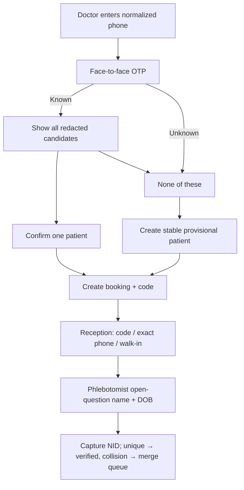
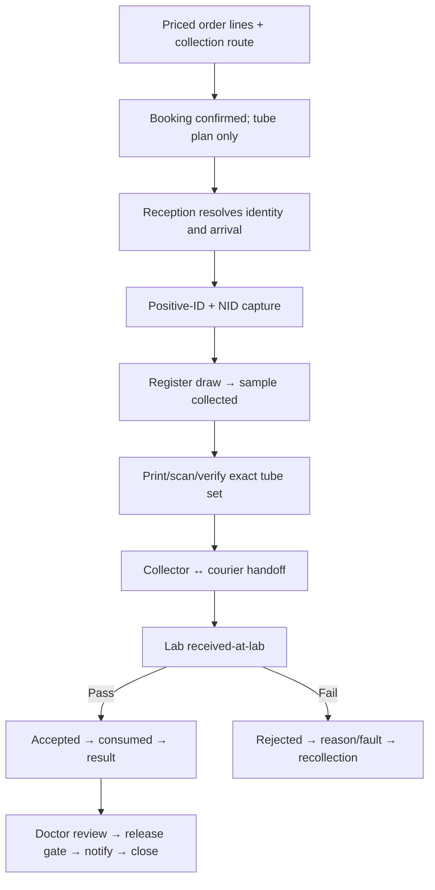

# Figma journey logic audit

Reviewed 2026-07-14. This audit intentionally ignores visual quality and evaluates only product logic, continuity, safety, state ownership, failure behavior, and cross-role completeness.

## Evidence

- [Patient Acquisition & Identity — node 1485:18526](https://www.figma.com/design/yWz269PzVjFQquJa1U1M0s/Kura-Design?node-id=1485-18526)
- [Lab Order & Sample Collection — node 1485:93177](https://www.figma.com/design/yWz269PzVjFQquJa1U1M0s/Kura-Design?node-id=1485-93177)
- [Patient journey snapshot](assets/figma/01-patient-acquisition-identity.png)
- [Order/phlebotomy journey snapshot](assets/figma/02-order-phlebotomy-lab.png)

The first journey has no prototype reactions. The second has component `CHANGE_TO` reactions, but no executable end-to-end navigation. Both should be treated as storyboards, not validated flows.

## Journey 1 — Patient Acquisition & Identity

### Logic represented correctly

- Phone precedes identity resolution.
- OTP is shown before patient candidates.
- Single match, shared phone, guardian/different patient, and no-match/provisional branches are represented.
- The provisional path collects a minimal identity before continuing to an order.

### P0/P1 logic defects

| Priority | Defect | Why it is unsafe/inconsistent | Required correction |
| --- | --- | --- | --- |
| P0 | Patient continuity changes between frames | Names, age/sex, and MRN change (for example Dara/Sok Nimol) without an identity event | Use one fixed scenario fixture per journey; any patient change must be an explicit branch |
| P0 | No positive-ID step at collection | Phone/OTP is incorrectly allowed to carry identity assurance into a specimen event | Add open-question name+DOB identification immediately before draw registration |
| P0 | Shared/guardian relationship is conflated with patient selection | Phone holder can become the patient by implication | Model contact/guardian, consent authority, and patient as separate roles |
| P1 | No duplicate/collision branch | A provisional patient can be created even when another record/NID already exists | Add exact/shared candidates, phone-scoped create serialization, NID collision, and merge-queue outcome |
| P1 | OTP exceptions omitted | Expiry, resend, mismatch, rate limit, and phone change have no behavior | Add explicit blocked states; phone edit invalidates the session |
| P1 | Sex requiredness is inconsistent | Same field behaves optional/required across branches | Define one product rule and apply it to create, disambiguation, and validation |
| P1 | Intake link lacks recipient/security semantics | Link delivery is shown without expiry, replay, authentication, or consent | Define token subject, expiry, one-time/replay behavior, recipient check, and audit |
| P1 | Reception three-door reality absent | Doctor path is presented as the only way to resolve the patient | Add booking-code, exact-phone, and walk-in entry paths for PSC reception |

### Corrected target flow

### Required reject/recovery frames

- OTP not sent, incomplete, mismatch, expired, rate-limited, resent, and phone changed.
- Shared phone with N≥2 candidates and “none of these.”
- Code invalid/expired/cancelled; exact phone has zero/one/multiple matches.
- Concurrent provisional creation on the same phone.
- Positive-ID missing or asked as a leading question.
- NID invalid and NID collision with post-episode merge.
- Intake link expired/replayed/wrong recipient.

## Journey 2 — Lab Order, Collection, and Handoff

### Logic represented correctly

- Catalog/cart and patient attachment precede order confirmation.
- PSC collection and doctor/clinic collection are separate route ideas.
- Tube requirements, labeling, scan/photo evidence, pickup, and awaiting-results concepts are visible.
- Payment/commission configuration is recognized as a distinct concern, even though its rule is wrong.

### P0 logic defects

| Defect | Evidence in storyboard | Required correction |
| --- | --- | --- |
| Same order changes contents | `ORD-58291` starts with 13 tests / $166, later shows 5 tests, 4 tubes, and only 3 results | Freeze a scenario fixture: line count, total, tube derivation, sample IDs, and result count must reconcile or a versioned edit/reflex/rejection event must explain the delta |
| Wrong label identity | A label reads `SOKHA · F · 1974` in Sok Nimol’s episode | Label data must be generated from the resolved patient/sample; mismatch blocks collection/handoff and triggers incident correction |
| “Samples prepared” precedes collection | Preparation copy implies a specimen exists before draw | Order confirmation creates a tube plan; normal sample is born only at registered draw |
| No positive-ID at chair | Tube work begins without two-identifier confirmation | Add open-question name+DOB immediately before draw |
| Photo capture equals label verification | Evidence acquisition and verification are conflated | Track `photo-captured`, `label-scanned`, `tube-set-matched`, and `handoff` as separate events |
| Manual label is an uncontrolled bypass | Printer/manual path can proceed without equivalent controls | Define downtime authorization, two identifiers, second check, reprint/invalidation, and audit |
| QR semantics unspecified | QR appears to confer state without subject/expiry/replay rules | Define token subject (sample/package/order), issuer, expiry, signature, one-time/replay policy, and authorized scanner |
| No lab accession decision | Story jumps from pickup to awaiting results | Add received-at-lab, accepted/rejected, consumed, discard, reason/fault, and recollection paths |
| Global 15% commission | One hard-coded percentage is treated as universal | Resolve per line from a versioned waterfall; noncommissionable lines are zero; snapshot at booking |
| Payment owner and trigger unclear | Payment is visually adjacent to order/sample states | Give payment its own intent/reconciliation state; it never advances visit/sample/result |

### Role coverage defect

The storyboard is doctor-centric. The operational journey requires explicit lanes for:

- receptionist: code/phone/walk-in resolution, arrival, payment/claim, queue;
- phlebotomist: positive-ID, NID, draw, labels, tube set, exception;
- courier: accept, pickup, handoff, exception;
- lab receiver: receive, inspect, accept/reject, accession;
- doctor reviewer: review, release, notify/close;
- finance/claims: payment, line-level coverage, split activation, reversal, settlement.

### Corrected target flow

### Required reject/recovery frames

- Empty/duplicate/overlapping cart, stale price, and idempotent double confirm.
- PSC slot unavailable; clinic/home route changed after pricing.
- Wrong patient/order at draw; positive-ID failure; no tests.
- Printer offline, duplicate barcode, wrong/extra/missing tube, insufficient volume, abandoned draw.
- Courier mismatch/no-show, lost package, broken seal, stability/temperature breach.
- Lab accept/reject, duplicate accession, recollection, and replacement sample lineage.
- Result unmatched, critical, corrected, notification failure, and release-gate remediation.
- Cash/KHQR/pay-link expired or duplicate callback; refund/void.
- Multi-line N≥2 commission/coverage/settlement sum with mixed rules.

## Cross-journey invariants Figma must preserve

| Invariant | Design requirement |
| --- | --- |
| Identity continuity | Fixed patient ID/name/DOB/sex/MRN across a scenario unless an explicit resolution/merge event occurs |
| Order arithmetic | Line count, total, tube derivation, payer responsibility, and result count reconcile through visible events |
| State independence | Separate visual/status objects for identity, visit, sample, payment, and result |
| Event evidence | QR/photo/button copy never substitutes for a server-owned transition |
| Authorization | Actor role is visible, but capability/workspace determines allowed actions |
| Idempotency | Retry/double click returns the same patient/booking/sample/payment/accession/ledger outcome |
| Audit | High-risk steps expose actor, workspace, time, source, reason, and prior/new state |
| Recovery | Every blocked state offers a safe next action without discarding the episode history |

## Design acceptance criteria

- Each storyboard scenario uses one immutable fixture manifest for patient, booking, lines, totals, tubes, samples, and results.
- Each P0 transition has a success frame, reject frame, and recovery frame.
- Every frame maps to one or more IDs in the [journey catalog](../01-journeys/journey-catalog.md) and [case matrix](../01-journeys/journey-case-matrix.md).
- Deferred flows such as claims, blood-in, automated payout, and polyclinic receptionist-on-behalf are labelled as future rather than shown as live.
- Prototype connections cover the journey, not only component variants, before the design is used as executable acceptance evidence.
