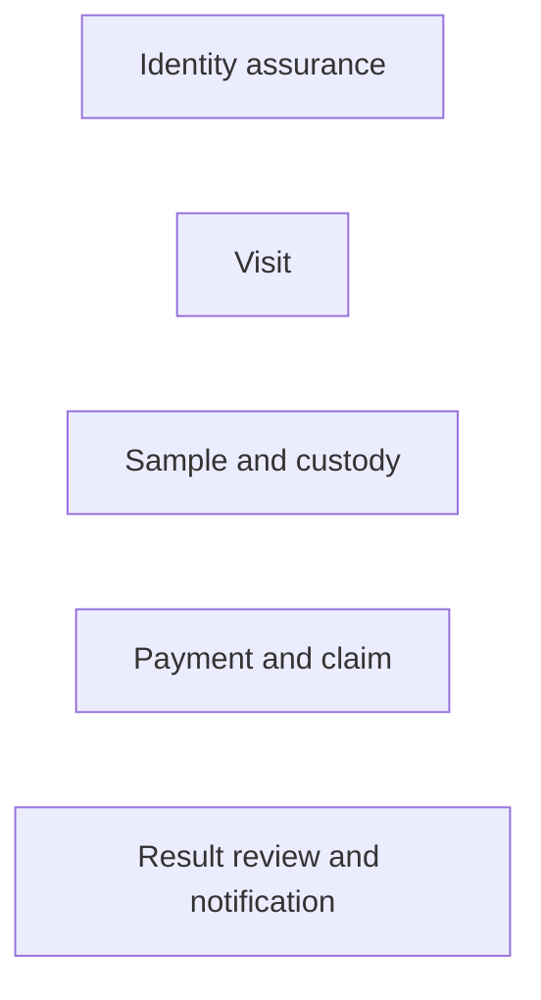

# Kura Clinic Product Truth Pack

Last consolidated: 2026-07-14.

This folder is the single entry point for product logic, journeys, business rules, design specifications, and audits for the Kura Clinic application. It covers the doctor, receptionist, phlebotomist, Kura operations, courier/lab, patient, payer, and finance views of the same episode of care.

UI appearance is not authoritative here. Product behavior, state transitions, permissions, ownership, auditability, reject branches, and recovery behavior are.

## How to use this pack

Read in this order:

1. [Complete Business, Product & Clinical Handbook](00-source-of-truth/handbook/Kura_Complete_Business_Product_Clinical_Handbook_2026-07-14.docx) for the compiled business-to-clinical operating-system narrative. Treat its evidence labels and source register as part of the document; it does not override higher-authority sources below.
2. [Clinic operations domain truth](00-source-of-truth/clinic-operations-domain-truth.md) for the current non-negotiable rules and state machines.
3. [End-to-end journeys](01-journeys/end-to-end-journeys.md) for complete cross-role lifecycle flows.
4. [Journey catalog](01-journeys/journey-catalog.md) to find every product surface and journey ID.
5. [Journey case matrix](01-journeys/journey-case-matrix.md) for happy, reject, exception, concurrency, and recovery cases.
6. [Source register](05-traceability/source-register.md) when two documents appear to conflict.
7. Legacy analysis/specification documents only for deeper historical detail or component behavior.

## Authority order

When two sources disagree, use this order:

1. Current clinic domain code and the domain-truth document.
2. Explicitly resolved business decisions in Kura Notion.
3. Current executable application behavior.
4. Kura platform/clinic architecture and service contracts.
5. Figma journeys and component flows.
6. Older product analysis, business specs, and design specs.

Delivery status is a separate question. A rule may be decided but not implemented; a screen may be implemented but still violate the decided rule. The coverage fields in this pack preserve that distinction.

## Folder map

```text
docs/kura-clinic/
├── 00-source-of-truth/
│   ├── handbook/
│   │   └── Kura_Complete_Business_Product_Clinical_Handbook_2026-07-14.docx
│   ├── clinic-operations-domain-truth.md
│   ├── master-source.md
│   └── product-goal.md
├── 01-journeys/
│   ├── end-to-end-journeys.md
│   ├── journey-catalog.md
│   ├── journey-case-matrix.md
│   ├── lab-catalog-order-journey.md
│   └── phone-gate-journey.md
├── 02-domain-and-rules/
│   ├── application-analysis.md
│   └── order-cart-business-rules.md
├── 03-design-specifications/
│   ├── design-system.md
│   ├── order-cart-design-spec.md
│   └── post-onboarding-activation-first-booking-prototype-spec.md
├── 04-audits-and-quality/
│   ├── assets/figma/
│   ├── canvas-pierre-ux-audit.md
│   ├── design-qa.md
│   └── figma-journey-logic-audit.md
└── 05-traceability/
    ├── document-register.md
    └── source-register.md
```

## Coverage vocabulary

| Label | Meaning |
| --- | --- |
| `IMPLEMENTED` | Evidence exists in current code or an executable flow. This does not imply production certification. |
| `PARTIAL` | Some states or branches exist, but at least one required branch, guard, or integration is missing. |
| `DECIDED` | Product logic is resolved and should guide implementation, but delivery is not proven. |
| `DESIGN-GAP` | The current Figma/prototype omits or contradicts required logic. |
| `DEFERRED` | Explicitly later/out of current product slice. It must not be presented as live. |
| `OPEN` | A real product, legal, clinical, or architecture decision remains. |

## The five independent lifecycle axes

Never infer one of these axes from another:



- Identity: `provisional → phone-verified → nid-verified`.
- Visit: `planned → arrived → identity-resolved → draw-complete → completed`, with cancellation where allowed.
- Sample: `awaiting-collection? → collected → received-at-lab → accepted → consumed`, with explicit reject/discard/recollection branches.
- Payment: `pending | waiting | deferred | pending-claim → collected | claimed → refunded | voided`.
- Result: `unreviewed → reviewed → notified → closed`.

Examples of prohibited coupling:

- A paid booking is not proof that the patient arrived.
- A QR/photo is not proof that a tube was collected or a label was verified.
- “Prepared” is not a sample lifecycle state.
- A completed draw does not mean the lab accepted the specimen.
- A lab result does not mean a doctor reviewed it or a patient was notified.
- A role label does not itself grant a capability.

## Product boundary

This pack covers:

- clinic access, KYD, workspace, membership, permission, and audit;
- patient search, phone gate, shared phone, provisional identity, receptionist intake, NID capture, duplicate/merge handling;
- patient chart, encounter, diagnosis, notes, orders, prescribing, referrals, records, activity, and care programs;
- lab catalog, cart, booking, clinic draw, PSC draw, home collection, tube/label/custody, courier handoff, accession, rejection, and recollection;
- result review, critical-result escalation, patient notification, release, and closure;
- cash, KHQR, patient pay-link, refund/void, claim, per-line pricing, commission, immutable ledger, and settlement;
- inbox, calendar, tasks, telehealth, dispensary, supplies, disclosures, referral program, settings, directory, e-signature, and security/audit;
- desktop/mobile parity, retries, offline recovery, concurrency, idempotency, and stale-state behavior.

Kura is not declared a complete EMR by this pack. Insurance claims, blood-in/send-in, automated payouts, multi-doctor polyclinic behavior, and some external-result workflows remain deferred or partially specified.

## Active prototype implementation specifications

- [Post-onboarding activation and first PSC booking prototype](03-design-specifications/post-onboarding-activation-first-booking-prototype-spec.md) — frozen mock-only contract for workspace activation, KYD branching, Explorer/Practice Home, and the first PSC booking.

## Non-negotiable safety rules

- Phone is a contact/login factor and blocking key, never a unique person identifier.
- Doctor-mediated OTP is face-to-face; changing the phone invalidates the verification session.
- Reception has three explicit doors: booking code, exact phone, walk-in.
- Shared-phone results require human disambiguation; no silent auto-selection.
- Positive identification happens at the draw using open questions for name and DOB.
- NID collision queues an audited merge after the active result episode; it does not silently merge or lose the draw.
- A sample is normally created at the draw, not at order placement.
- Every custody handoff is actor-, workspace-, location-, and timestamp-attributed.
- Result release requires the configured identity, sample, review, and notification gates.
- Commission is resolved per line and snapshotted; settlement activates only when payment and service are both proven.
- Corrections use auditable reversals, not history mutation.

## Known source limitation

The ChatGPT “Kura project” could not be enumerated through the available project/browser bridge. This pack therefore does not claim that private ChatGPT project conversations were reviewed. The gap is recorded in the [source register](05-traceability/source-register.md); all available local code/docs, the supplied Figma journeys, GitHub context, and relevant Notion pages were used.
